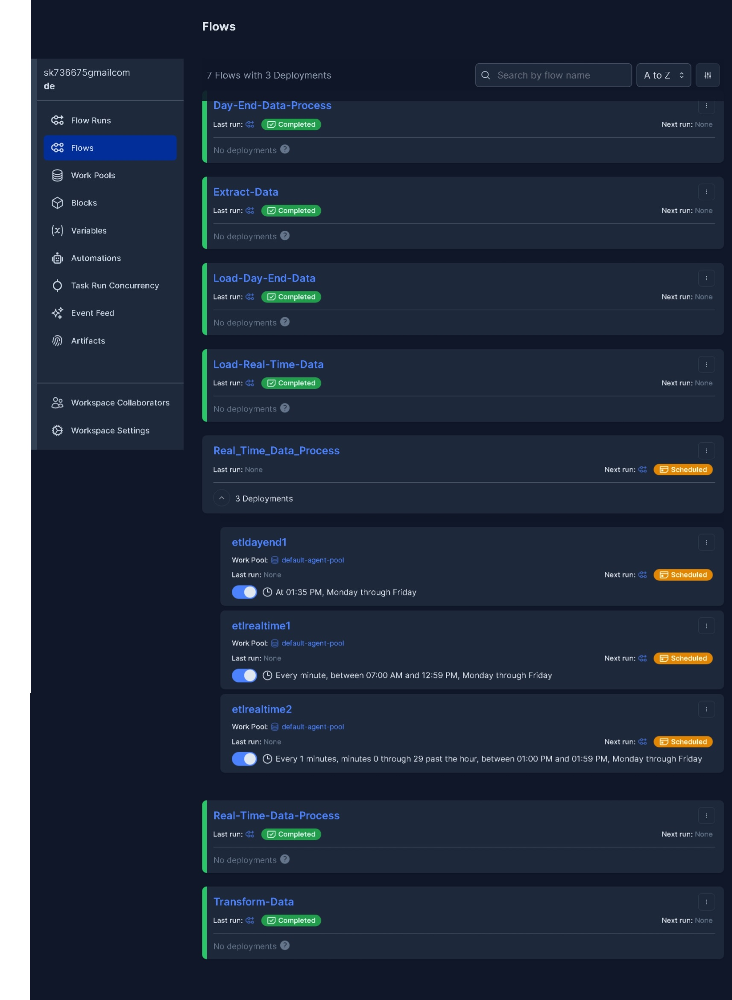

# DE-Project
Data Engineering Project- Using Prefect (Scheduling Tool) and MongoDB as Database and Nodes JS with React for data visualization
1. Load 1 time Batch data Historical Price data of chosen stocks using pymongo (python) to Mongodb Database (downloaded from nasdaq.com)
2. Schedule Real time data loading from Finnhub API to Mongodb Dataase using Prefect Orchestration Tool (updates data everey 1 minute )
3. Visulaize all data in React-NodeJs APP
## Screenshot of Schedules in Prefect

## Screenshot of React App

